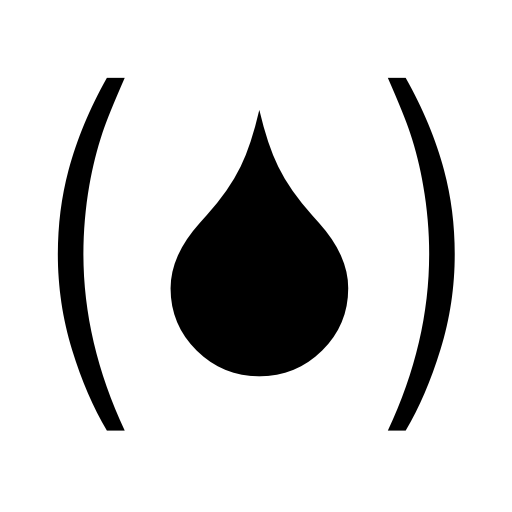

# fuel-lang == FUEL(isp)
FUEL(isp) is a fast usable embeddable lisp interpreter (currently for the .NET platform and native C++ and since december 2023 also for [Haxe](https://haxe.org/)). 
FUEL is written in C#, C++ and Haxe. All target platforms for Haxe are supported: JavaScript, Java, C++, C#, Python, Lua, PHP, Neko, HashLink.

FUEL
----
FUEL is a lisp interperter which is intended to be used as a scripting
and extension language for applications.

FUEL comes with a command line application which can execute programs: 

    >type test.fuel
    (println "hello fuel")
    
    >fuel.exe test.fuel
    hello fuel
  
The FUEL interpreter can easily be embedded into .NET applications.
Just link the CsLispInterpreter.dll to your .NET solution and use
the static Lisp.Eval() function.

    using CsLisp;
  
    ...
  
    // script = "(* 6 7)"
    private double InvokeFuelScript(string script)
    {
        // evaluate the given script
        LispVariant result = Lisp.Eval(script);
        
        // convert result to expected type
        double d = result.DoubleValue;
        
        // returns 42
        return d;
    }
  
Objects from the embedding application can easily be registered 
at the FUEL interpreter and used in a script.

    private double InvokeFuelScriptWithAppObj(string script, string appObjName, object appObj)
    {
        var nativeItems = new Dictionary<string, object>();
        nativeItems[appObjName] = appObj;
        
        // script = '(call appObjName "MethodName" args ...)'
        LispVariant result = Lisp.Eval(script, nativeItems: nativeItems);
        
        return result.DoubleValue;
    }

Even complete classes can be registered at the FUEL interpreter.

    (import fuellib)
    
    ;; register in FUEL script
    (evalstr (create-native "FUEL_name" "full_NET_name"))
    
    ;; use in FUEL script
    (def obj (create-FUEL_name))    ; create native object
    (FUEL_name-DoIt obj 123)        ; use native object
    

The FUEL interpreter can also easily be embedded into native C++ applications.
Just add the source code files contained in the CppLispInterpreter.pri file to your C++ project
and use the static Lisp::Eval() function.

    #include "Lisp.h"
    
    using namespace CppLisp;
    
    ...
  
    // script = "(* 6 7)"
    static double InvokeFuelScript(const string & script)
    {
        // evaluate the given script
        std::shared_ptr<LispVariant> result = Lisp::Eval(script);
        
        // convert result to expected type
        double d = result->DoubleValue();
        
        // returns 42
        return d;
    }

    
Interactive loop
----------------
FUEL comes with an interactive loop.

    >fuel -i
  
    FUEL(isp) v0.99.1 (for .NET/C#) from 31.3.2016, (C) by Michael Neuroth
  
    Type "help" for informations.
  
    FUEL(isp)-DBG> (println "Hello fuel")
    hello fuel
    result=Hello fuel
    FUEL(isp)-DBG>

  
Debugger
--------
FUEL comes with a command line debugger. 

    >fuel -d test.fuel
  
    FUEL(isp) v0.99.1 (for .NET/C#) from 31.3.2016, (C) by Michael Neuroth
  
    Type "help" for informations.
  
    --> do line=1 start=-3 stop=-1 module=test.fuel
    FUEL(isp)-DBG>
  
A graphical front end for the debugger is available in the VisiScript
Text Editor in version 0.6.0 and above. 
See: http://mneuroth.de/projects/Visiscript.html.

Compiler
--------
FUEL comes with a compiler (experimental). The compiler is not yet implemented for the native C++ environment.

    >fuel -c test.fuel
  

Documentation
-------------
For more documentation of the FUEL language see:

    >fuel --doc
  
Or navigate to the homepage(s):

https://github.com/mneuroth/fuel-lang
    
http://mneuroth.de/projects/Fuel.html.
  
Or inspect the demo and test scripts and
look at the TestAppUsingFuel project.

Compiling
---------
To compile the C# version of fuel just open the solution file CsLisp/CsLisp.sln in
Microsoft Visual Studio and build the solution.

To compile the C++ version of fuel open the solution file CppLisp/CppLisp.sln in
Microsoft Visual Studio and build the solution. Or use the qmake tool from [Qt](https://www.qt.io/):

    >cd CppLisp
    >qmake -r CppLisp.pro
    >make
    
The CMake build tool is also supported:

    >cd CppLisp
    >cmake CMakeLists.txt
    >make    

    
Deployment  
----------
The binary distribution of FUEL for the .NET platform consists of the following components:

    LICENSE                   (license)
    README.md                 (this file)
    fuel.exe                  (command line application)
    fuel.exe.config           
    Library/fuellib.fuel      (standard library)
    FuelInterpreter.dll     
    FuelDebugger.dll          (optional)
    FuelCompiler.dll          (optional)

The binary distribution of FUEL for the native C++ platform(s) consists of the following components:

    LICENSE                   (license)
    README.md                 (this file)
    fuel.exe                  (command line application)
    Library/fuellib.fuel      (standard library)
    FuelInterpreter.dll     
    FuelDebugger.dll          (optional)
    
  
Platforms  
---------
FUEL is developed with C# for the Microsoft .NET version 3.5 under Windows.
FUEL can be used with mono environment under Linux and Mac OS X.

FUEL is also available for native C++ for all platforms supporting a C++11 compiler.
FUEL was successfully compiled on Windows, Android, Linux (including the Raspberry Pi) and Mac OS X. 

* Github Actions: 
    * Linux  
            
			
    * Windows 
	          
	          
	* MacOS 
           	
			
	        
Benchmarks
----------

Benchmark results on Windows 11 Dell XPS 17 with i7-11800H CPU (December 2023 with version 0.99.6):

| Executable         | Platform            | benchmark.fuel [s] |
|---                 |---                  |---                 |
| Fuel.exe           | Windows C# native   |  0.8               |
| Fuel.exe           | Windows C++ native  |  1.7               |
|                    |                     |                    |
| Fuel.exe           | Windows Haxe_C#     |  5.6               |
| FuelCpp.exe        | Windows Haxe_C++    |  0.7               |
| java -jar fuel.jar | Windows Haxe_Java   |  3.6               |
| python fuel.py     | Windows Haxe_Python | 95.4               |
| neko fuel.n        | Windows Haxe_Neko   | 30.0               |
|                    |                     |                    |
| Fuel.exe           | WSL Haxe_C#         |  5.7               |
| FuelCpp.exe        | WSL Haxe_C++        |  1.3               |
| java -jar fuel.jar | WSL Haxe_Java       |  5.1               |
| node fuel.js       | WSL Haxe_JavaScript |  1.6               |
| python fuel.py     | WSL Haxe_Python     | 87.5               |
| neko fuel.n        | WSL Haxe_Neko       | 41.7               |
| hl fuel.hl         | WSL Haxe_HashLink   |  6.4               |

License
-------
FUEL is released under the MIT license:

>  FUEL(isp) is a fast usable embeddable lisp interpreter.
>  
>  Copyright (c) 2016-2023 Michael Neuroth
>
>  Permission is hereby granted, free of charge, to any person obtaining
>  a copy of this software and associated documentation files (the "Software"),
>  to deal in the Software without restriction, including without limitation
>  the rights to use, copy, modify, merge, publish, distribute, sublicense,
>  and/or sell copies of the Software, and to permit persons to whom the
>  Software is furnished to do so, subject to the following conditions:
>
>  The above copyright notice and this permission notice shall be included
>  in all copies or substantial portions of the Software.
>
>  THE SOFTWARE IS PROVIDED "AS IS", WITHOUT WARRANTY OF ANY KIND, EXPRESS
>  OR IMPLIED, INCLUDING BUT NOT LIMITED TO THE WARRANTIES OF MERCHANTABILITY,
>  FITNESS FOR A PARTICULAR PURPOSE AND NONINFRINGEMENT. IN NO EVENT SHALL
>  THE AUTHORS OR COPYRIGHT HOLDERS BE LIABLE FOR ANY CLAIM, DAMAGES OR
>  OTHER LIABILITY, WHETHER IN AN ACTION OF CONTRACT, TORT OR OTHERWISE,
>  ARISING FROM, OUT OF OR IN CONNECTION WITH THE SOFTWARE OR THE USE OR
>  OTHER DEALINGS IN THE SOFTWARE.
  
